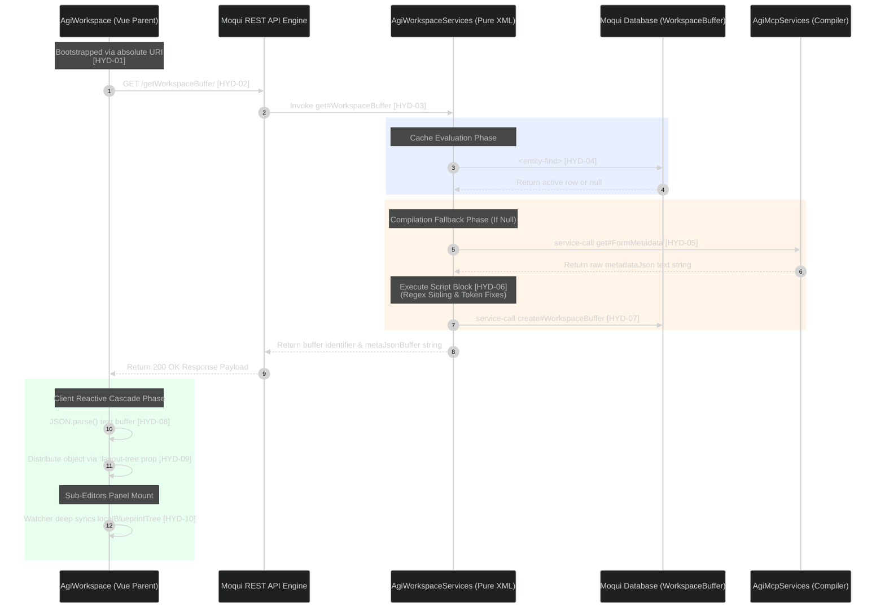

# AgiWorkspace Hydration Blueprint & Traceability Matrix

## 2. Lookup section
| Key | Phase / Event | Layer Involved | Technical Mechanism / Operation | Architectural Responsibility |
| :--- | :--- | :--- | :--- | :--- |
| <nobr>`[HYD-01]`</nobr> | Workspace Bootstrap | `AgiWorkspace.xml` | Declarative XML `<container>` rendering `<agi-workspace>` with absolute path. | Guarantees that a qualified Moqui component path identifier is established on startup. |
| <nobr>`[HYD-02]`</nobr> | Initialization Fetch | `AgiWorkspace.qvt.js` | JavaScript HTTP client requests initialization data via `fetch()` on mount. | Triggers the centralized state hydration process before child editors paint any canvas nodes. |
| <nobr>`[HYD-03]`</nobr> | API Route Inbound | `agi-ai.rest.xml` | HTTP endpoint mapped to `name="getWorkspaceBuffer"` for type `GET`. | Exposes the underlying database caching engine to standard web application requests. |
| <nobr>`[HYD-04]`</nobr> | Cache Evaluation | `AgiWorkspaceServices.xml` | Standard Moqui `<entity-find>` query checking `org.moqui.ai.WorkspaceBuffer`. | Isolates database lookup configurations completely away from the frontend client runtime. |
| <nobr>`[HYD-05]`</nobr> | Metadata Compilation | `AgiWorkspaceServices.xml` | `<service-call>` executing the raw XML-to-JSON parsing engine. | Pulls the original source code schema from the disk when a file is opened for the first time. |
| <nobr>`[HYD-06]`</nobr> | Server-Side Self-Healing | `AgiWorkspaceServices.xml` | Groovy string regex replacements (`.replaceAll()`) inside service `<script>`. | Fixes malformed layout syntax strings (sibling braces, JSON-LD tokens) before database storage. |
| <nobr>`[HYD-07]`</nobr> | Buffer Persistence | UDM Engine | `<service-call>` invoking `create#org.moqui.ai.WorkspaceBuffer` with auditing. | Caches baseline structural configurations to ensure data integrity during prompt updates. |
| <nobr>`[HYD-08]`</nobr> | Client Hydration | `AgiWorkspace.qvt.js` | Parent app uses native `JSON.parse()` to ingest the server's string buffer. | Converts the raw network text stream into a single, unified reactive source-of-truth object. |
| <nobr>`[HYD-09]`</nobr> | Downward Cascade | Vue Core Engine | Unidirectional data flow binding master map to sub-editors via `:layout-tree`. | Triggers synchronized rendering refreshes across all separate canvas and source tabs instantly. |
| <nobr>`[HYD-10]`</nobr> | State Shielding | Sub-Editor Panels | Vue `watch` with `deep: true` cloning incoming property to local state. | Isolates uncommitted browser edits inside the active panel view, protecting parent data integrity. |