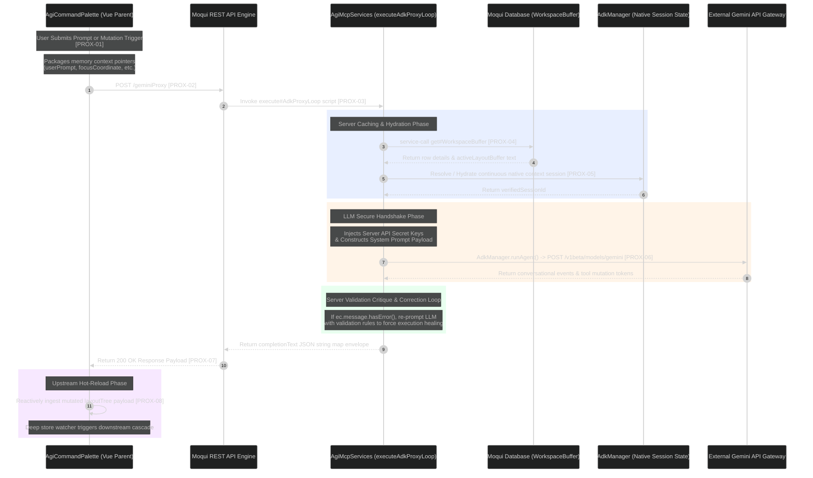

# AgiWorkspace Hydration Blueprint & Traceability Matrix

### 2. Lookup section (Corrected)
| Key | Phase / Event | Layer Involved | Technical Mechanism / Operation | Architectural Responsibility |
| :--- | :--- | :--- | :--- | :--- |
| <nobr>`[PROX-01]`</nobr> | Prompt Trigger | `AgiCommandPalette.qvt.js` | User inputs text query; app tracks active cursor coordinate context parameters. | Packages user intent alongside real-time frontend file pointer attributes before submitting across network lines. |
| <nobr>`[PROX-02]`</nobr> | Secure Outbound POST | Axios HTTP Client | JavaScript executes an authenticated `axios.post()` to `/rest/s1/agi-ai/geminiProxy` with `axiosConfig`. | Passes the active session token to bypass gates while pushing data to the network layer. |
| <nobr>`[PROX-03]`</nobr> | Direct Proxy Route | `agi-ide.rest.xml` | REST engine processes route definition and executes target service artifact script. | Bypasses mid-tier web controllers to trigger your core backend script compilation line immediately. |
| <nobr>`[PROX-04]`</nobr> | Cache Layer Sync | `AgiWorkspaceServices` | Script issues a synchronous internal `<service-call>` to `get#WorkspaceBuffer`. | Pulls the active layout tree string directly from database memory to guarantee backend state accuracy. |
| <nobr>`[PROX-05]`</nobr> | Token Session Warm-Up | `AdkManager` Core | System matches browser transaction tokens against an active `ConcurrentHashMap` cache. | Restores or provisions a dedicated, continuous execution footprint mapping to the LLM agent instance. |
| <nobr>`[PROX-06]`</nobr> | Secure LLM Handshake | Google Gemini API | Server issues a secure outbound call injecting backend credentials and rules context. | Completely screens critical API workspace keys from reaching client environments. |
| <nobr>`[PROX-07]`</nobr> | Serialized Delivery | Moqui REST Engine | Packs parsed token results directly into a structured `completionText` response variable. | Completes network processing loops by delivering clean JSON payloads straight back to browser contexts. |
| <nobr>`[PROX-08]`</nobr> | Workspace Cascade | Vue Core / Pinia | Component extracts fresh mutation data maps, triggering a unidirectional down-tree redraw. | Synchronizes both drawing workspace screens and text views instantly without file reloads. |